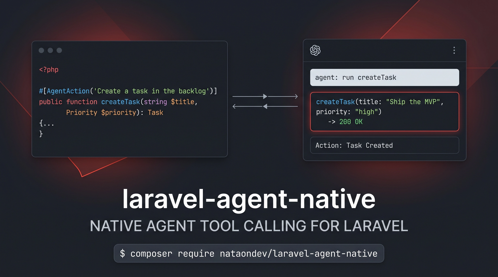

# laravel-agent-native

<p align="center">
  
</p>

> Inspired by the Agent-Native architecture pioneered by [Builder.io](https://github.com/builderio/agent-native), brought natively to the Laravel & Livewire ecosystem.

Define an action **once** — a plain PHP method with an attribute. Your Livewire UI calls it, and LLM agents get it as a standards-compliant tool. No duplicated schemas, no manual tool registries.

```php
#[AgentAction(description: 'Add a product to the shopping cart')]
public function addItem(int $productId, int $quantity = 1): void
{
    $this->items[] = compact('productId', 'quantity');
}
```

→ auto-compiled to OpenAI/MCP tool JSON, validated and executed through the container, with Livewire state/events in sync.

## Install

```bash
composer require nataondev/laravel-agent-native
php artisan vendor:publish --tag=agent-native-config
```

- PHP 8.2+ · Laravel 11+ · Livewire 3+ or 4+ (optional)

## How it works

1. **Annotate** — `#[AgentAction]` on any public method (service or Livewire component).
2. **Compile** — reflection builds the tool schema from native types, enums, and docblocks.
3. **Execute** — `ActionExecutor` validates arguments, resolves the class via the container, invokes, and returns a structured `ActionResult`.
4. **React** — `AgentBridge` notifies your app (and listening components) that the agent acted.

## Documentation

| Guide | What's inside |
|---|---|
| [Installation](docs/installation.md) | Requirements, setup, registering classes |
| [Defining actions](docs/defining-actions.md) | `#[AgentAction]`, `#[AgentParam]`, `#[AgentExpose]`, docblocks |
| [Type mapping](docs/type-mapping.md) | Scalars, arrays, backed/pure enums, nullability → JSON Schema |
| [Executing actions](docs/executing-actions.md) | `ActionExecutor`, `ActionResult`, error codes |
| [Livewire integration](docs/livewire.md) | `InteractsWithAgent`, `AgentBridge`, component state |
| [HTTP endpoint](docs/http-endpoint.md) | `AgentToolsController` routes, security, payloads |
| [MCP server](docs/mcp.md) | Optional `laravel/mcp` bridge — actions as standard MCP tools |
| [Artisan commands](docs/artisan-commands.md) | `agent:inspect`, `agent:cache`, `agent:clear`, `agent:mcp` |
| [Caching](docs/caching.md) | Zero-reflection production boot |

## Quick example

```bash
php artisan agent:inspect --json   # tool schemas, ready for your LLM
```

```php
use AgentNative\Laravel\Engine\ActionExecutor;

$result = app(ActionExecutor::class)->call('addItem', ['productId' => 42]);

$result->ok;     // true
$result->output; // JSON-safe return value
```

## Testing

```bash
composer test   # Pest — 35 tests
composer lint   # Pint
```

## License

MIT
