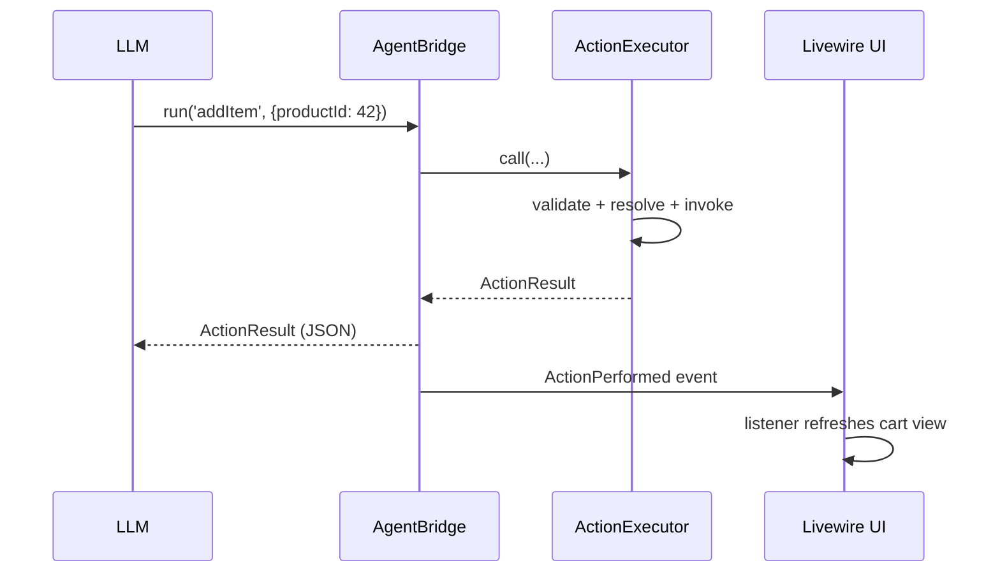

# Livewire Integration

Make a component's methods agent-invokable with one trait. The **same method** is called by your Blade UI and by the agent — identical semantics.

## `InteractsWithAgent`

```php
use AgentNative\Laravel\Attributes\AgentAction;
use AgentNative\Laravel\Livewire\InteractsWithAgent;
use Livewire\Component;

class Cart extends Component
{
    use InteractsWithAgent;

    public array $items = [];

    #[AgentAction(description: 'Add a product to the shopping cart')]
    public function addItem(int $productId, int $quantity = 1): void
    {
        $this->items[] = compact('productId', 'quantity');
    }
}
```

On component boot the trait registers the class with the `ActionRegistry` — no config entry needed once the component is mounted. (Listing it in `config/agent-native.php` also works and keeps tools available without a prior page load.)

## Sharing component state with the agent

`agentContext()` controls what the agent can see (default: all public properties):

```php
public function agentContext(): array
{
    return ['itemCount' => count($this->items)];
}
```

## Executing with notification: `AgentBridge`

Run an action and notify the app that the agent acted:

```php
use AgentNative\Laravel\Livewire\AgentBridge;

$result = app(AgentBridge::class)->run('addItem', ['productId' => 42]);
```

This fires an `ActionPerformed` event. Listen from anywhere — including other Livewire components — to refresh UI:

```php
use AgentNative\Laravel\Livewire\ActionPerformed;

Event::listen(ActionPerformed::class, function ($event) {
    $event->result->ok;
    $event->result->action;
    $event->result->output;
});
```

> **Note:** Livewire 3 events are component-scoped, so the bridge uses a Laravel event as the server-side broadcast primitive. Components opt into updates via listeners; there is no silent global re-render.

## Typical flow



Next: [HTTP endpoint](http-endpoint.md)
